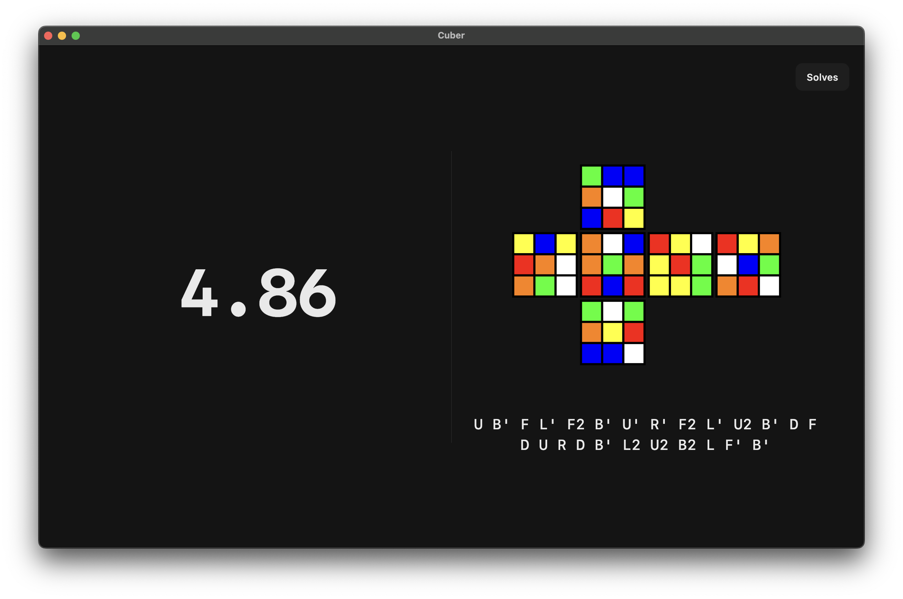
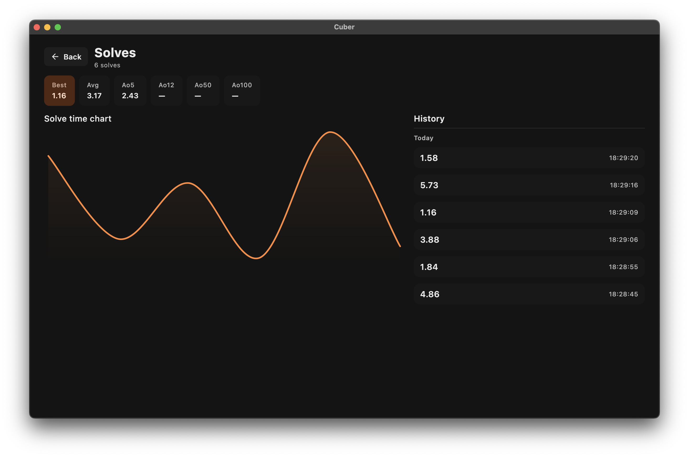
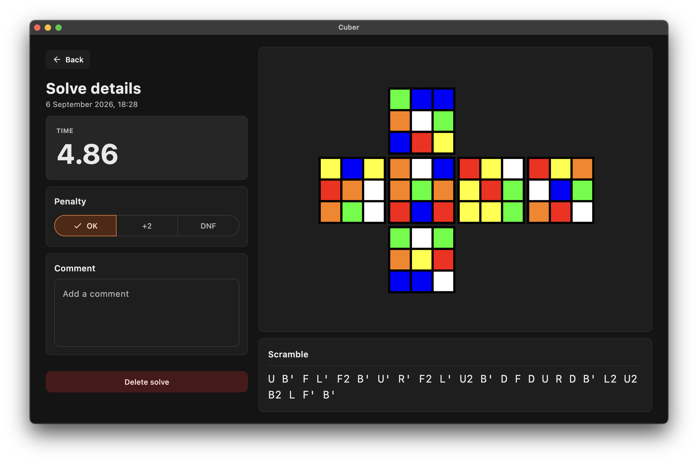

<div align="center">


<h1>
  Cuber
</h1>

**Experimental [Cuber](https://github.com/jvqtil/Cuber) fork** for desktop. Windows, MacOS and Linux supported

[**Usage**](#usage)
&nbsp;•&nbsp;
[**Features**](#features)
&nbsp;•&nbsp;
[**Contributing**](#contributing)

<a href="https://github.com/jvqtil/CuberDesktop/releases/latest">
  
</a>

<br>
<br>

<table>
  <tr>
    <td></td>
    <td></td>
    <td></td>
  </tr>
</table>

</div>

## Usage
Click the timer to start/stop. **Long press** to reset.
Use escape key to go back from any menu. When pressed on timer screen - navigates to solves

## Features

- Fast and simple **speedcubing** timer
- WCA-style **3×3 scrambles**
- **Visual scramble preview**
- Solves history
- **Statistics**
- **`+2`** and **`DNF`** penalties
- Comments for individual solves
- Local-only storage

## Contributing

### Building
Requires JDK 17.

Run locally:
```bash
./gradlew :desktopApp:run
```

Build native packages on the target OS:
```bash
./gradlew :desktopApp:packageDmg     # macOS
./gradlew :desktopApp:packageExe     # Windows
./gradlew :desktopApp:packageDeb     # Debian / Ubuntu
```

## Thanks to

* [tnoodle-lib](https://github.com/thewca/tnoodle-lib) — Scramble generation library.
